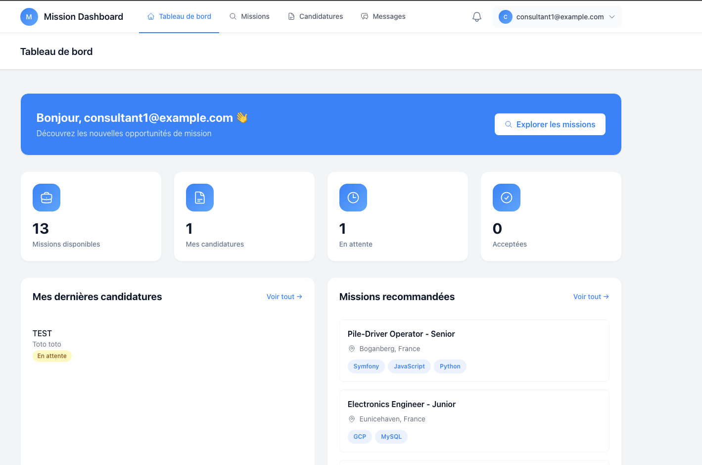
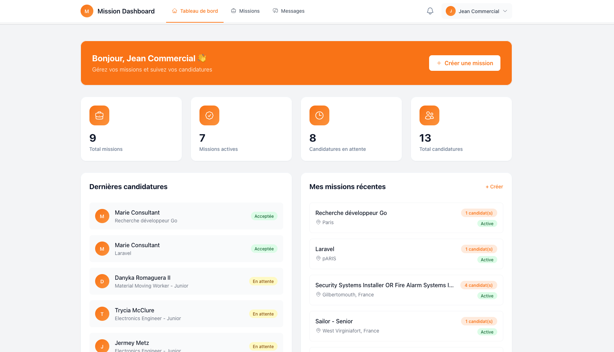
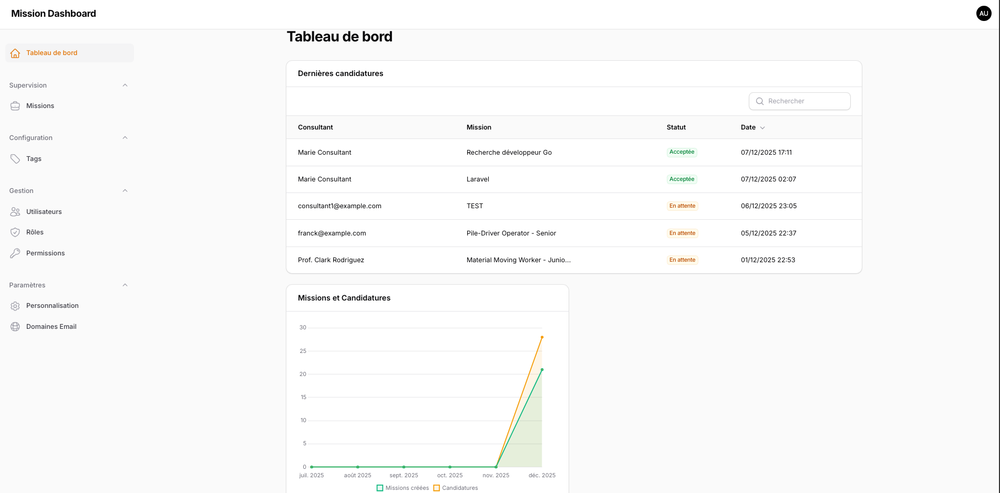

# Mission Dashboard

> 🤖 **Note :** Ce projet a été vibe codé à l'aide d'une IA.

Un portail interne moderne pour les **ESN (Entreprises de Services du Numérique)** afin de simplifier la gestion des missions et l'allocation des talents. Imaginez un mini LinkedIn pour votre organisation, connectant les consultants avec les équipes commerciales.

## 🎯 Présentation

La gestion des missions et des talents dans une entreprise de services numériques est souvent complexe. Les consultants sont régulièrement affectés à des projets clients, tandis que les équipes commerciales doivent identifier rapidement les profils adaptés à chaque opportunité.

**Mission Dashboard** centralise la gestion des missions et des candidatures, facilitant la mise en relation entre consultants et commerciaux, tout en donnant aux administrateurs une vue complète sur l'activité de la plateforme.

### Fonctionnalités clés

- **Diffusion des missions** — Les commerciaux peuvent publier des missions avec des tags (développeur, DevOps, IA, etc.)
- **Notifications intelligentes** — Les consultants reçoivent automatiquement des notifications quand des missions correspondent à leurs compétences
- **Candidatures simplifiées** — Les consultants peuvent facilement postuler aux missions et suivre le statut de leurs candidatures
- **Messagerie en temps réel** — Système de messagerie intégré pour des échanges rapides entre consultants et commerciaux
- **Tableau de bord administrateur** — Supervision complète avec gestion des utilisateurs, tags, missions et statistiques d'activité

---

## 👥 Acteurs de la plateforme

### 🧑‍💻 Consultant

Les consultants créent leur profil, postulent aux missions et reçoivent des notifications adaptées à leurs compétences.

**Fonctionnalités :**

- Créer et gérer son profil (bio, compétences, tags, CV)
- Parcourir et filtrer les missions disponibles par tag/compétence
- Postuler aux missions et suivre l'historique des candidatures
- Recevoir des notifications pour les missions correspondantes
- Échanger des messages avec les équipes commerciales



---

### 💼 Commercial

Les équipes commerciales publient des missions, examinent les candidatures et contactent les consultants qualifiés.

**Fonctionnalités :**

- Créer, modifier et archiver des missions
- Associer des tags aux missions
- Voir et filtrer les candidatures par compétences des consultants
- Accéder aux profils détaillés des consultants
- Mettre à jour le statut des candidatures (en attente, acceptée, refusée)
- Contacter les consultants via la messagerie



---

### 🛠️ Administrateur

Les administrateurs supervisent la plateforme, gèrent les utilisateurs et les tags, et accèdent aux statistiques d'activité.

**Fonctionnalités :**

- Gérer les utilisateurs (consultants, commerciaux, admins)
- Définir et modifier les rôles et permissions
- Gérer la bibliothèque de tags (dev, cloud, data, IA...)
- Voir toutes les missions et l'activité de la plateforme
- Accéder au tableau de bord avec statistiques
- Configurer les paramètres de la plateforme (ex: domaines email autorisés)



---

## 🛠️ Stack technique

| Technologie | Version | Utilisation |
|-------------|---------|-------------|
| **Laravel** | 12 | Framework PHP |
| **Livewire** | 3.7 | Framework full-stack pour Laravel |
| **Filament** | 4 | Générateur de panneau d'administration |
| **Laravel Reverb** | - | Serveur WebSocket pour les fonctionnalités temps réel |
| **Pest** | 3 | Framework de tests |
| **PostgreSQL** | 16 | Base de données |
| **Redis** | 7 | Cache, files d'attente, sessions |
| **Tailwind CSS** | 4 | Styles |
| **Mailpit** | - | Test des emails |
| **pgAdmin** | - | Gestion de base de données |

---

## 🚀 Démarrage

### Prérequis

- Docker & Docker Compose

### Installation

1. **Cloner le dépôt :**

```bash
git clone https://github.com/francky-d/mission-dashboard.git
cd mission-dashboard
```

2. **Copier le fichier d'environnement :**

```bash
cp .env.example .env
```

3. **Installer les dépendances PHP (première fois uniquement) :**

```bash
docker run --rm \
    -u "$(id -u):$(id -g)" \
    -v "$(pwd):/var/www/html" \
    -w /var/www/html \
    laravelsail/php84-composer:latest \
    composer install --ignore-platform-reqs
```

4. **Démarrer tous les services :**

```bash
./vendor/bin/sail up -d
```

5. **Générer la clé d'application :**

```bash
./vendor/bin/sail artisan key:generate
```

6. **Exécuter les migrations et alimenter la base de données :**

```bash
./vendor/bin/sail artisan migrate --seed
```

7. **Installer les dépendances Node et compiler les assets frontend :**

```bash
./vendor/bin/sail npm install
./vendor/bin/sail npm run dev
```

8. **Démarrer le serveur WebSocket (pour la messagerie temps réel) :**

```bash
./vendor/bin/sail artisan reverb:start
```

### Arrêter les services

```bash
./vendor/bin/sail down
```

### Identifiants par défaut

| Rôle | Email | Mot de passe |
|------|-------|--------------|
| Admin | `admin@example.com` | `password` |
| Commercial | `commercial@example.com` | `password` |
| Consultant | `consultant@example.com` | `password` |

---

## 🌐 Services disponibles

| Service | URL | Description |
|---------|-----|-------------|
| Espace Consultant | <http://localhost/consultant> | Tableau de bord consultant et candidatures |
| Espace Commercial | <http://localhost/commercial> | Tableau de bord commercial et gestion des missions |
| Panneau Admin | <http://localhost/admin> | Interface d'administration (Filament) |
| Mailpit | <http://localhost:8025> | Interface de test des emails |
| pgAdmin | <http://localhost:5050> | Gestion de la base de données PostgreSQL |

### Interfaces Consultant & Commercial

- **Espace Consultant** (`/consultant`) : Gestion du profil, navigation des missions, candidatures, messagerie
- **Espace Commercial** (`/commercial`) : Création de missions, revue des candidatures, profils des consultants

### Mailpit (Test des emails)

Tous les emails envoyés par l'application sont capturés par Mailpit. Accédez à l'interface web à <http://localhost:8025> pour visualiser les emails envoyés (notifications, réinitialisation de mot de passe, etc.).

### pgAdmin (Gestion de la base de données)

**Identifiants :**

- **Email :** `admin@admin.com`
- **Mot de passe :** `admin`

**Connexion à PostgreSQL :**

1. Ouvrir pgAdmin à <http://localhost:5050>
2. Ajouter un nouveau serveur avec :
   - **Hôte :** `pgsql`
   - **Port :** `5432`
   - **Base de données :** `laravel`
   - **Utilisateur :** `sail`
   - **Mot de passe :** `password`

---

## 🧪 Exécuter les tests

```bash
./vendor/bin/sail artisan test
```

Ou directement avec Pest :

```bash
./vendor/bin/sail pest
```

---

## 📦 Développement

**Compiler les assets pour le développement :**

```bash
./vendor/bin/sail npm run dev
```

**Compiler les assets pour la production :**

```bash
./vendor/bin/sail npm run build
```

**Exécuter le linting du code :**

```bash
./vendor/bin/sail bin pint
```

**Exécuter l'analyse statique :**

```bash
./vendor/bin/sail php vendor/bin/phpstan analyse
```

---

## 📄 Licence

Ce projet est un logiciel open source sous licence [MIT](https://opensource.org/licenses/MIT).
